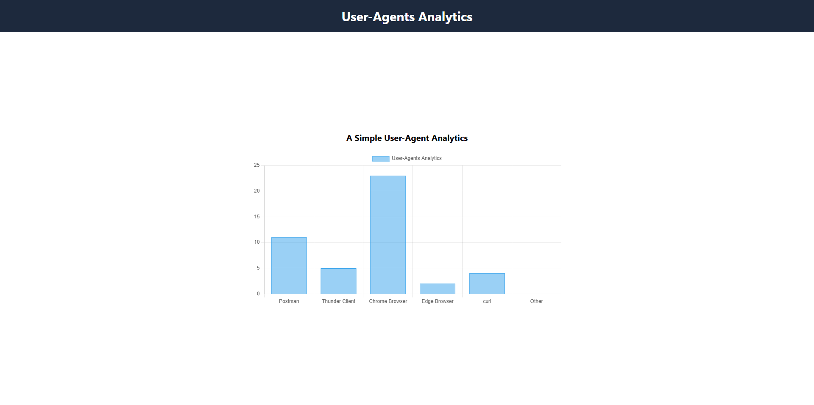
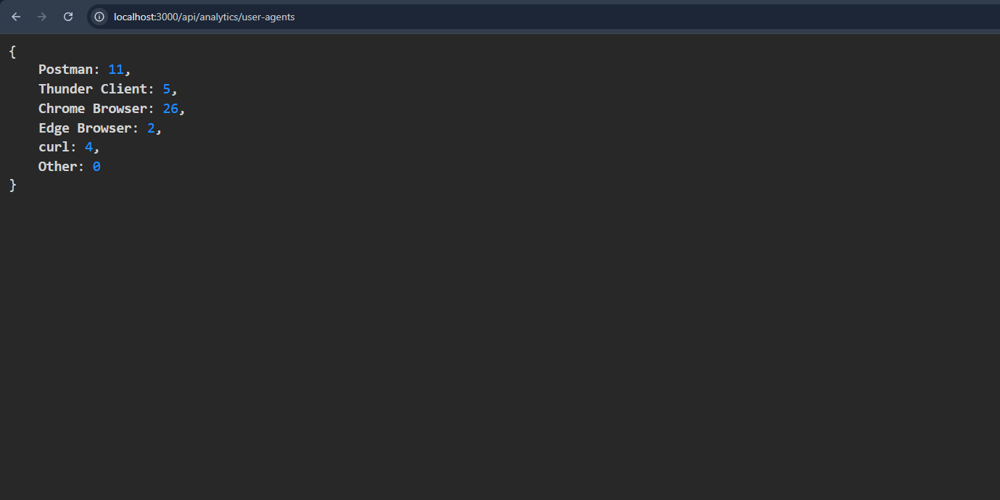

# A Lightweight User-Agent Analytics Tool

This is a simple user-agent analytics tool using Express.js and using chart.js to show the analytics in a bar chart. This app tracks the user-agents from the request header of users api call and store in a json file using `fs` and `path` modules thougth a middleware. Also send a html file as response where user-agent analytics are showing in a bar chart.

## Clone the repository

Clone the repository from the project root:

```bash
git clone https://github.com/Nazmul1582/user-agent-analytics-tool.git
```

## Navigate to the project directory and install dependencies

```bash
cd user-agent-analytics-tool
npm install
```

## Run the server

```bash
npm start
```

## API Endpoints

1. Get the data - GET /api/analytics/user-agents

   - URL example: http://localhost:3000/api/analytics/user-agents

2. View the bar chart - GET /api/analytics
   - URL example: http://localhost:3000/api/analytics

## Screenshots



